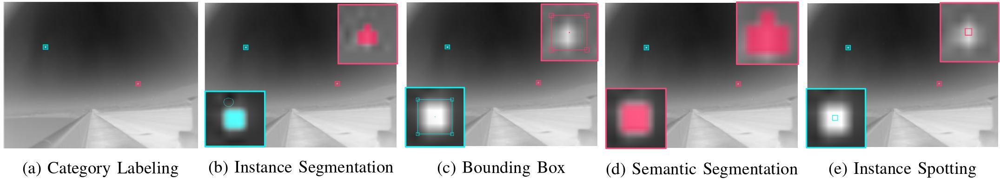

Single-frame InfraRed Small Target (SIRST) Benchmark
==============

A dataset proposed in "Asymmetric Contextual Modulation for Infrared Small Target Detection" <https://arxiv.org/abs/2009.14530>

## Dataset Description

SIRST is a dataset specially constructed for **single-frame** infrared small target detection, in which the images are selected from hundreds of infrared sequences for different scenarios. 




The bounding box and semantic segmentation annotations are available now. The rest annotation forms will come soon.

<div>


</div>

## Learderboard

The full learderboard will come soon. 
A comparison of 19 methods can be found at <https://github.com/YimianDai/open-acm>.

## Toolkit

The full toolkit will come soon. 
Some implementations of our proposed methods can be found at [DENTIST](https://github.com/YimianDai/DENTIST), [ACM](https://github.com/YimianDai/open-acm), and [ALCNet](https://github.com/YimianDai/open-alcnet).

## Citation

Please cite our paper in your publications if our work helps your research. BibTeX reference is as follows.

```
@inproceedings{dai21acm,
  title   =  {Asymmetric Contextual Modulation for Infrared Small Target Detection},
  author  =  {Yimian Dai and Yiquan Wu and Fei Zhou and Kobus Barnard},
  booktitle =  {{IEEE} Winter Conference on Applications of Computer Vision, {WACV} 2021}
  year    =  {2021}
}

@article{TGRS21ALCNet,
  author    = {{Dai}, Yimian and {Wu}, Yiquan and {Zhou}, Fei and {Barnard}, Kobus},
  title   = {{Attentional Local Contrast Networks for Infrared Small Target Detection}},
  journal = {IEEE Transactions on Geoscience and Remote Sensing},
  pages   = {1--12},
  year    = {2021},
}
```

